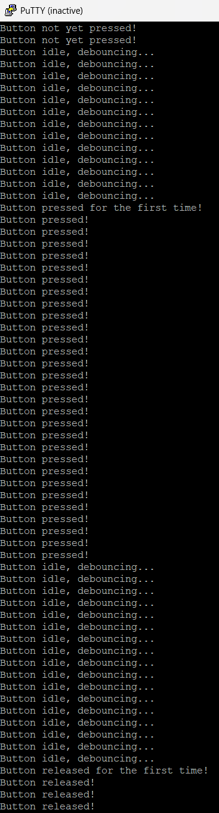

# Button State Zephyr project

Project for PEP task in C programming language featuring Button State state machine.

Tested on Nucleo F446RE board.  
Unit tests missing  
 - Initial idea is to make project copy with dummy functions.  
 - Mock values and get as many possible outcomes.  
 